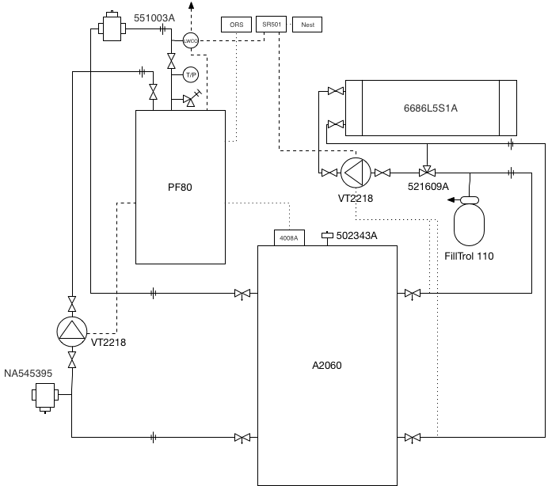

# Heating System

## General Overview

The system can be broken out into two main subsystems connected by a buffer tank which acts as a thermal buffer to
prevent short-cycling, and also provides hydraulic separation. The supply side consists of a mod-con boiler feeding
directly into the buffer tank. The demand side consists of a single manifold which feeds all the underfloor heating
loops in the house, drawing hot water from the buffer tank. 

The two sides of the system are connected only by the buffer tank; they share no controls or other piping (other than
a system-wide LWCO control), and operate completely independently. 

Graphically, the system looks like:

## Supply Side Overview

The supply side monitors the temperature of the buffer tank via an aquastat, and is responsible for maintaining the tank
at a constant temperature (plus or minus the aquastst differential). The circulation pump is controlled via the boiler
and runs at a constant speed for the duration of the boiler firing plus a post-purge interval. Outdoor reset operation
is used in order to automatically shut the boiler down in the summer months, but the slope of the reset curce is
deliberately set to be flat. For all intents and purposes other than automated warm weather shutdown, the system can be
thought of as a conventional aquastat driven demand system without outdoor reset in the traditional sense.  Where
outdoor reset functionality is needed to optimize the delivery of heat to the house, it is provided for on the demand
side.

The target output of the boiler is selected to maximize the thermal energy stored in the buffer (and thus minimize short
cycling of the boiler) while keeping the return temperature low enough to ensure efficient combustion. The interplay 
between boiler target, aquastat setting and aquastat differential is a delicate balance and may require tuning, though
it should eventually converge as the boiler is not subject to outdoor reset ramping in the conventional sense.

## Demand Side Overview

Operation of the demand side is driven by a single thermostat calling for heat. Heat is drawn from the buffer tank,
which is the only supply that the demand side 'knows' about; from the perspective of the demand side the buffer tank
looks like a bottomless source of hot water that is always at or above the target distribution temperature. Upon a call
for heat, a relay powers the demand side circulation pump. The mixing valve keeps the supplied temperature at a constant
which will always be lower than the temperature of water in the buffer tank. The ciculation pump operates in delta-t
mode, and ensures that flow through the emitters provides the a constant temperature drop through the distribution
network while minimizing the energy required by the pump.

It is worth noting that the temperature maintained in the buffer tank is independent of the temperature delivered to the
distribution network, which is maintained by the mixing valve on the demand side. As long as the buffer tank's
temperature is greater than the target distribution temperature (which it should be at all times other than
start-of-season startup), the mixing valve will be able to throttle the supply temperature down to the desired
distribution temperature. In fact, it is typically advantageous to have the buffer tank temperature quite a bit higher
than the distribution temperature in order to maximize the amount of energy buffered and to minimize short cycling. 

## Supply Side Operating Modes

TBD

## Demand Side Operating Modes

TBD

## Low Water Cut Off Operating Modes

The LWCO is located above the boiler, at the highest point in the system aside from the distribution network. It is
connected to mains voltage via a removeable plug (to facilitate emergency operation of the system via a generator), and
feeds the entire system's electrical needs (specifically, it feeds the boiler and the demand side relay). In normal
(filled) state, it is closed and passes current normally. Should the LWCO indicate a leak or sensor failure, its relay
will open and the system electrical supply will be cut off. 

## Component Schedule

The supply side consists of

* 1x Peerless Purefire PF80 condensing boiler
* 1x Taco VT2218 variable speed pump w/ Freedom Flanges
* 1x Caleffi 551003A air separator w/ 538402FD blowdown valve
* 1x Caleffi NA545395 magnetic dirt separator
* 1x Whirlpool A2060 / E1F20US015V 19 Gallon DHW tank
* 1x Honeywell 4008A aquastat
* 2x boiler isolation ball valves
* 2x buffer tank isolation ball valves w/ 2 sided drain & unions

The demand side consists of

* 1x Caleffi 6686L5S1A 10 position manifold
* 1x Taco VT2218 variable speed pump w/ Freedom Flanges
* 1x Caleffi 521609A mixing valve
* 1x FillTrol 110 expansion tank & fill valve
* 2x buffer tank isolation ball valves w/ 2 sided drain & unions
* 1x Taco SR501 switching relay
* 1x Nest thermostat

The control system also includes

* 1x Taco LTA1203S-2 low water cutoff

## Fill & Purge Plan

TBD

Consult idronics 4 to confirm this makes sense:

* Close valves into buffer tank, fill demand side loop by loop
* Open bottom demand buffer tank valve, wait until air valve full (remove top of air valve and close tank valve when water reaches level)
* Open bottom supply side, wait until air valve full (how to check?)
* Open top tank valves
* Pump to purge

## Boiler Room Network Design

TBD

## Distribution Network Design (and photos)

TBD

## Electrical Design

TBD - mention ECO switch by door to utility room, plug disconnect

## Future Expansion

The eventual goal is to outfit the manifold with zone valves, put an ecobee wireless transmitter in each room, and
control the lot of it from a Pi / Arduino and a CC1101 transceiver. To control the pump speeds, it's
likely going to require a bunch of thermometers and the ability to 'fake' the sensor thermometers, in addition to
some sort of feedback control mechanism. Relays will also be needed to turn the boiler and pumps on and off. It's still
an unknown how outdoor reset will factor into the distribution network, since the mixing valve cannot be controlled
automatically.  In terms of hardware, the AD5206 is a potentially good digital potentiometer to look like a fake
thermometer.
